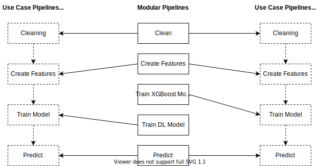

# Introduction

A use case pipeline in OptimusAI is a template pipeline that indicates the steps a team must implement to solve the use case problem. Use case pipelines are constructed from building blocks known as modular pipelines.

The following example use case pipeline consists of four blocks:

* cleaning
* create features
* train model
* predict

The pipeline can comprise different modular pipelines since is easy to swap out a single step. For example, you can switch from a deep learning approach to XGBoost to train the model, as shown below. In Implementation A (left) the use case pipeline uses the Train DL Model for the train model step. Implementation B (right) instead uses the Train XGBoost modular pipeline instead for the train model step.



You can also write new modular pipelines, or customise existing ones, for flexibility as you solve a use case for a client.

### What is a modular pipeline?

Each modular pipeline is a [Kedro pipeline](https://kedro.readthedocs.io/en/stable/02_get_started/03_hello_kedro.html), which can be thought of as similar to a python package, in that it is self contained, and provides clearly defined methods.

### How to use a modular pipeline

To use a modular pipeline you must first import it into your use case, and then instantiate it through the `create_pipeline` method. For example, the `split` pipeline can be created as follows:


```python
from core_pipelines.pipelines import split

my_pipeline = split.create_pipeline()
```


Inspect the pipeline to see what it will run:


```python
for node in my_pipeline.nodes:
    print(node.name)
    print('\tInputs:', node.inputs)
    print('\tOutputs:', node.outputs)
    print()

    split_data
    	Inputs: ['params:split', 'data']
    	Outputs: ['test', 'train']

```

This pipeline has a single step, which is called `split_data`.

This pipeline has two inputs: the parameters config `params:split`, and the dataset `data`.

This pipeline also provides two outputs: the datasets `train` and `test`.

These input and outputs point to `parameters.yml` and `catalog.yml` entries in our Kedro configuration. Most likely though, we don't want to use these names, but instead pass in our own inputs, outputs, and parameters. We can do this by wrapping the modular pipeline in a `pipeline` object:


```python
from kedro.pipeline import pipeline

my_pipeline = pipeline(
    pipe=split.create_pipeline(),
    inputs={
        "data": "my_catalog_dataset"
    },
    outputs={
        "train": "my_train_dataset",
        "test": "my_test_dataset"
    },
    parameters={
        "params:split": "params:my_parameters"
    }
)
```

If we inspect the pipeline now, we can see that the inputs and outputs will have been updated.


```python
for node in my_pipeline.nodes:
    print(node.name)
    print('\tInputs:', node.inputs)
    print('\tOutputs:', node.outputs)
    print()

    split_data
    	Inputs: ['params:my_parameters', 'my_catalog_dataset']
    	Outputs: ['my_test_dataset', 'my_train_dataset']
```


### How to reuse a modular pipeline

If you use the modular pipeline more than once, you must also provide a namespace for the pipeline to run in. By default, the namespace will always be the name of the pipeline. Each node in the pipeline has its name prefixed with this namespace.

> Note: In any Kedro project, the node names must be unique.

The `pipeline` wrapper that we used previously has an argument called `namespace` that will allow you to avoid naming clashes. For example:


```python
from kedro.pipeline import pipeline

my_pipeline_a = pipeline(
    pipe=split.create_pipeline(),
    namespace="a"
)

my_pipeline_b = pipeline(
    pipe=split.create_pipeline(),
    namespace="b"
)
```

We have created two pipelines, one with the namespace `a`, the other with the namespace `b`.


```python
for node in my_pipeline_a.nodes:
    print(node.name)
    print('\tInputs:', node.inputs)
    print('\tOutputs:', node.outputs)
    print()

    a.split_data
    	Inputs: ['params:split', 'a.data']
    	Outputs: ['a.test', 'a.train']
```


```python
for node in my_pipeline_b.nodes:
    print(node.name)
    print('\tInputs:', node.inputs)
    print('\tOutputs:', node.outputs)
    print()

    b.split_data
    	Inputs: ['params:split', 'b.data']
    	Outputs: ['b.test', 'b.train']

```

### Linking multiple modular pipelines
We can link two or more pipelines to create one single pipeline. This helps us to stitch our building blocks together to create an end-to-end pipeline. Let's see how we can do this by linking the `clean` pipeline with the `split` pipeline.

First, let us inspect the nodes in the `clean` pipeline.


```python
from core_pipelines.pipelines import clean

my_pipeline_clean = clean.create_pipeline()

for node in my_pipeline_clean.nodes:
    print(node.name)
    print('\tInputs:', node.inputs)
    print('\tOutputs:', node.outputs)
    print()

    unify_timestamp_col_name
    	Inputs: ['params:clean', 'data']
    	Outputs: ['unify_timestamp_col_name']

    set_timezones
    	Inputs: ['params:clean', 'unify_timestamp_col_name']
    	Outputs: ['set_timezones']

    round_timestamps
    	Inputs: ['params:clean', 'set_timezones']
    	Outputs: ['round_timestamps']

    drop_duplicates
    	Inputs: ['params:clean', 'round_timestamps']
    	Outputs: ['drop_duplicates']

    enforce_schema
    	Inputs: ['drop_duplicates', 'td']
    	Outputs: ['enforce_schema']

    remove_outlier
    	Inputs: ['params:clean', 'enforce_schema', 'td']
    	Outputs: ['output']
```

In order to link the `clean` pipeline to the `split` pipeline, the input for the node `unify_timestamp_col_name` must point to the output from the `split` pipeline.


```python
from kedro.pipeline import pipeline, Pipeline

my_split_pipeline = pipeline(
    pipe=split.create_pipeline(),
    inputs={
        "data": "my_catalog_dataset"
    },
    outputs={
        "train": "my_train_dataset",
        "test": "my_test_dataset"
    },
    parameters={
        "params:split": "params:my_split_parameters"
    }
)

my_clean_pipeline = pipeline(
    pipe=clean.create_pipeline(),
    inputs={
        "data": "my_train_dataset",
        "td": "my_tag_dictionary"
    },
    outputs={
        "output": "my_clean_train_dataset"
    },
    parameters={
        "params:clean": "params:my_clean_parameters"
    }
)

my_combined_pipeline = Pipeline([
    my_split_pipeline,
    my_clean_pipeline

])
```

Notice how the `split` pipeline output is the input for the `clean` pipeline. We can inspect the pipeline to confirm the same.


```python
for node in my_combined_pipeline.nodes:
    print(node.name)
    print('\tInputs:', node.inputs)
    print('\tOutputs:', node.outputs)
    print()

    split_data
    	Inputs: ['params:my_split_parameters', 'my_catalog_dataset']
    	Outputs: ['my_test_dataset', 'my_train_dataset']

    unify_timestamp_col_name
    	Inputs: ['params:my_clean_parameters', 'my_train_dataset']
    	Outputs: ['unify_timestamp_col_name']

    set_timezones
    	Inputs: ['params:my_clean_parameters', 'unify_timestamp_col_name']
    	Outputs: ['set_timezones']

    round_timestamps
    	Inputs: ['params:my_clean_parameters', 'set_timezones']
    	Outputs: ['clean.round_timestamps']

    drop_duplicates
    	Inputs: ['params:my_clean_parameters', 'round_timestamps']
    	Outputs: ['drop_duplicates']

    enforce_schema
    	Inputs: ['drop_duplicates', 'my_tag_dictionary']
    	Outputs: ['enforce_schema']

    remove_outlier
    	Inputs: ['params:my_clean_parameters', 'enforce_schema', 'my_tag_dictionary']
    	Outputs: ['my_clean_train_dataset']

```


### Defining your own modular pipeline
New modular pipeline definitions within Optimus follow several conventions, enumerated here:

1) The associated `params` block should be keyed by the name of the modular pipeline. For example, the `train_model` pipeline will have nodes which take `params:train_model` in their `pipeline.py` definition.
2) Pipelines defined within the `create_pipeline` function within the `pipeline.py` file in a new modular pipeline do **not** use the `namespace` argument.
3) The folder holding your new modular pipeline definition should have a flat internal structure. That is the `pipeline.py` file will sit next to files defining the nodes it uses.
4) [Documentation] - Please include at least a README.md within the modular pipeline folder you're adding, to serve as documentation for yourself and other
future users. Example usage, perhaps within a stand-alone example jupyter notebook, may also be helpful. 
