# PyPlot_Charts pipeline

This is a modular pipeline to generate MatPlotLib figures from pandas data.

## Overview

This modular pipeline contains several standard plots that are used in many different studies. Each can be generated by providing only data and parameters to the pipeline.

## Correlation plot

Plots the correlation between all variables in a given input data frame.

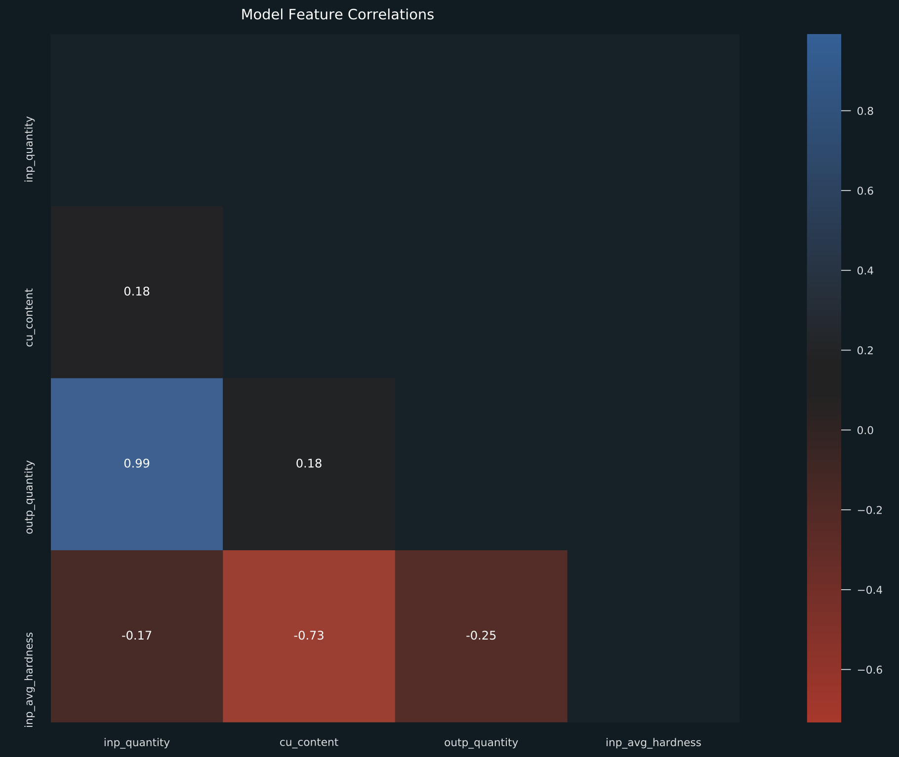

### Parameters

You must provide the following parameters in your `parameters.yml` file:

```yaml
correlation_plot:
    figsize: [16, 9]                         # The size of the figure
    title: "My Plot Title"                   # The title of the figure
    mask: True                               # Indicates if upper diagonal should be masked out
    method: "pearson"                        # Correlation method (see pd.DataFrame.corr method)
```

### Pipeline

The following pipeline example will create the plot.

```python
from core_pipelines.pipelines import pyplot_charts

pipeline(
    pipe=pyplot_charts.create_pipeline().only_nodes("correlation_plot"),          # name of plot to create
    inputs={"correlation_data": "my_data"},                                       # map input data
    outputs={"correlation_plot": "my_plot"},                                      # map output plot
    parameters={"params:correlation_plot": "params:correlation_plot"}             # provide params
)
```


## Scatter plot

Creates a scatter plot between two variables in a given data frame. Optionally, you can provide a colour and size variable.

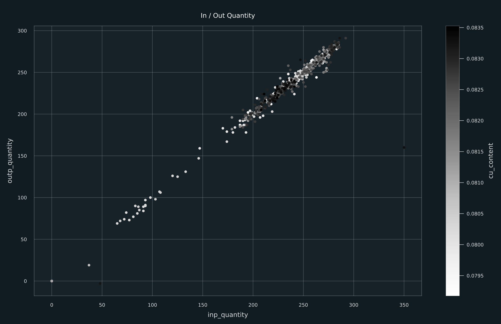

### Parameters

You must provide the following parameters in your `parameters.yml` file:

```yaml
scatter_plot:
    figsize: [16, 9]                         # The size of the figure
    title: "My Plot Title"                   # The title of the figure
    x_col: "inp_quantity"                    # Column name for x-axis
    y_col: "outp_quantity"                   # Column name for y-axis, or list of columns
    color_col: "cu_content"                  # (Optional) column to colour points
    size_col: "size_col"                     # (Optional) column to size points
```

### Pipeline

The following pipeline example will create the plot.

```python
from core_pipelines.pipelines import pyplot_charts

pipeline(
    pipe=pyplot_charts.create_pipeline().only_nodes("scatter_plot"),              # name of plot to create
    inputs={"scatter_data": "my_data"},                                           # map input data
    outputs={"scatter_plot": "my_plot"},                                          # map output plot
    parameters={"params:scatter_plot": "params:scatter_plot"}                     # provide params
)
```


## Density plot

Creates a density plot for each specified column in the given input dataframe.

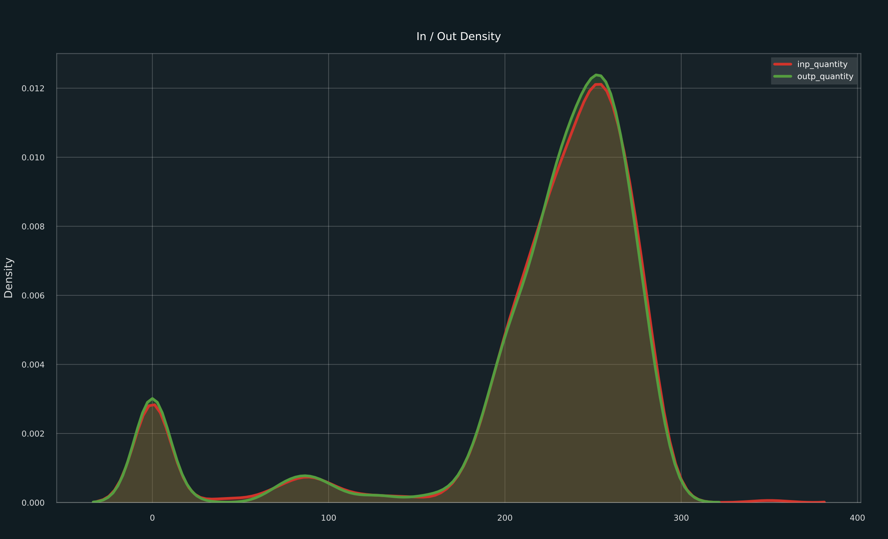

### Parameters

You must provide the following parameters in your `parameters.yml` file:

```yaml
density_plot:
    figsize: [16, 9]                             # The size of the figure
    title: "My Plot Title"                       # The title of the figure
    columns: ["inp_quantity", "outp_quantity"]   # list of columns to plot density for
```

### Pipeline

The following pipeline example will create the plot.

```python
from core_pipelines.pipelines import pyplot_charts

pipeline(
    pipe=pyplot_charts.create_pipeline().only_nodes("density_plot"),              # name of plot to create
    inputs={"density_data": "my_data"},                                           # map input data
    outputs={"density_plot": "my_plot"},                                          # map output plot
    parameters={"params:density_plot": "params:density_plot"}                     # provide params
)
```

## Box plot

Creates a box plot for the specified column in the given input dataframe.

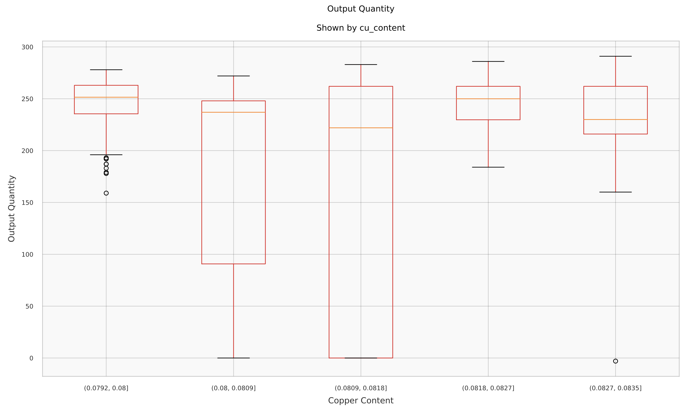

### Parameters

You must provide the following parameters in your `parameters.yml` file:

```yaml
density_plot:
    figsize: [16, 9]                             # The size of the figure
    title: "My Plot Title"                       # The title of the figure
    subtitle: "My Plot Subtitle"                 # The subtitle of the figure
    x_label: "X Axis Label"                      # Label for the x-axis
    y_label: "Y Axis Label"                      # Label for the y-axis
    column: "y_col"                              # Column to create box-plot for
```

Optionally, you may also group your box plot by adding the `by` parameter in one of the following ways:

```yaml
    # Group by every value in a column
    # Works well with categoric data or numeric with few values
    by:
        column: "x_col"

    # Group by explicitly binning values
    by:
        column: "x_col"
        bins: [["a", "b"], ["c"]]

    # Group by interval ranges
    # Works only for numeric group by columns
    by:
        column: "x_col"
        bins: [(100, 150), (150, 200)]

    # Group into fixed range buckets
    by:
        column: "x_col"
        bins: 5

    # Group into quantile range buckets
    by:
        column: "x_col"
        quantiles: 5
```

### Pipeline

The following pipeline example will create the plot.

```python
from core_pipelines.pipelines import pyplot_charts

pipeline(
    pipe=pyplot_charts.create_pipeline().only_nodes("box_plot"),              # name of plot to create
    inputs={"box_data": "my_data"},                                           # map input data
    outputs={"box_plot": "my_plot"},                                          # map output plot
    parameters={"params:box_plot": "params:box_plot"}                         # provide params
)
```

## Partial dependency plot

Creates a partial dependency plot for each specified column in the given input dataframe.

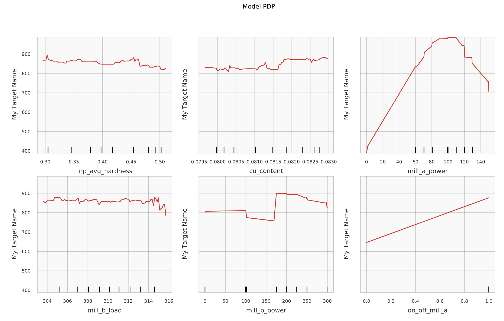

### Parameters

You must provide the following parameters in your `parameters.yml` file:

```yaml
partial_dependency_plot:
    figsize: [16, 9]                             # The size of the figure
    title: "My Plot Title"                       # The title of the figure
    columns: ["inp_quantity", "outp_quantity"]   # list of columns to create pdp for
    ylabel: "Label"                              # Optionally show the ylabel on pdps
```

### Pipeline

The following pipeline example will create the plot.

```python
from core_pipelines.pipelines import pyplot_charts

pipeline(
    pipe=pyplot_charts.create_pipeline().only_nodes("partial_dependency_plot"),     # name of plot to create
    inputs={
        "partial_dependency_data": "my_data",                                       # map input data
        "partial_dependency_model": "my_model"                                      # map input model
    },
    outputs={"partial_dependency_plot": "my_plot"},                                 # map output plot
    parameters={"params:partial_dependency_plot": "params:partial_dependency_plot"} # provide params
)
```


## Bar plot

Creates a bar plot from pandas `DataFrame`.

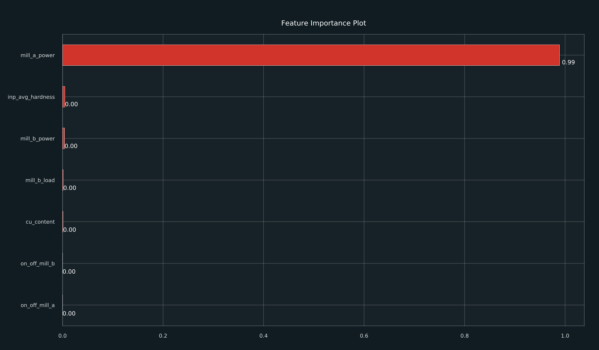

### Parameters

You must provide the following parameters in your `parameters.yml` file:

```yaml
bar_plot:
    figsize: [16, 9]                             # The size of the figure
    title: "My Plot Title"                       # The title of the figure
    y: "feature_importance"                      # Optional: the variable[s] to plot
    sort_by: "feature_importance"                # Optional: sort variable[s]
    annotate: True                               # Optional: annotate bar values
```

### Pipeline

The following pipeline example will create the plot.

```python
from core_pipelines.pipelines import pyplot_charts

pipeline(
    pipe=pyplot_charts.create_pipeline().only_nodes("bar_plot"),     # name of plot to create
    inputs={"bar_data": "my_data"},                                  # map input data
    outputs={"bar_plot": "my_plot"},                                 # map output plot
    parameters={"params:bar_plot": "params:bar_plot"}                # provide params
)
```


## Actual vs predicted plot

Plots actual value vs predicted value, with a trend line between them.

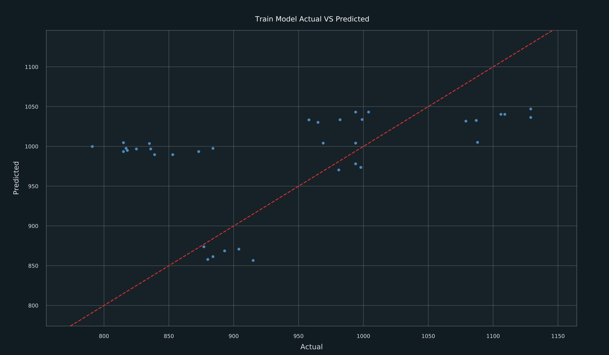

### Parameters

You must provide the following parameters in your `parameters.yml` file:

```yaml
actual_vs_predicted_plot:
    figsize: [16, 9]                             # The size of the figure
    title: "My Plot Title"                       # The title of the figure
    prediction_col: "prediction"                 # The column containing predictions
    target_col: "outp_quantity"                  # The column containing target
```

### Pipeline

The following pipeline example will create the plot.

```python
from core_pipelines.pipelines import pyplot_charts

pipeline(
    pipe=pyplot_charts.create_pipeline().only_nodes("actual_vs_predicted"),           # name of plot to create
    inputs={"actual_vs_predicted_data": "my_data"},                                   # map input data
    outputs={"actual_vs_predicted_plot": "my_plot"},                                  # map output plot
    parameters={"params:actual_vs_predicted_plot": "params:actual_vs_predicted_plot"} # provide params
)
```


## Actual vs residual plot

Plots actual value vs residual value with a trend line between them.

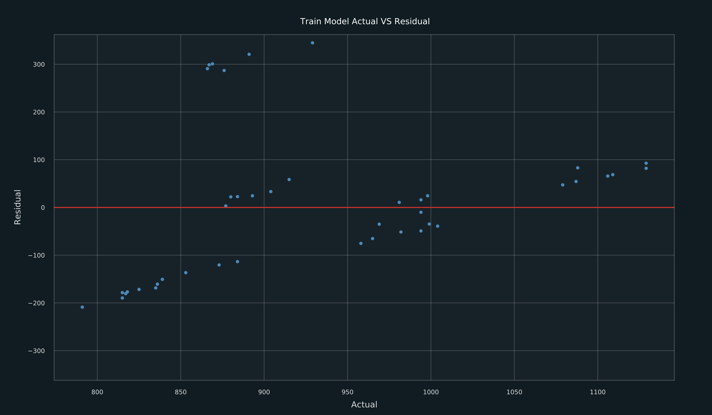

### Parameters

You must provide the following parameters in your `parameters.yml` file:

```yaml
actual_vs_residual_plot:
    figsize: [16, 9]                             # The size of the figure
    title: "My Plot Title"                       # The title of the figure
    prediction_col: "prediction"                 # The column containing predictions
    target_col: "outp_quantity"                  # The column containing target
```

### Pipeline

The following pipeline example will create the plot.

```python
from core_pipelines.pipelines import pyplot_charts

pipeline(
    pipe=pyplot_charts.create_pipeline().only_nodes("actual_vs_residual"),           # name of plot to create
    inputs={"actual_vs_residual_data": "my_data"},                                   # map input data
    outputs={"actual_vs_residual_plot": "my_plot"},                                  # map output plot
    parameters={"params:actual_vs_residual_plot": "params:actual_vs_residual_plot"}  # provide params
)
```


## Timeline plot

Plots the timeline of each specified column based on a given timestamp column.

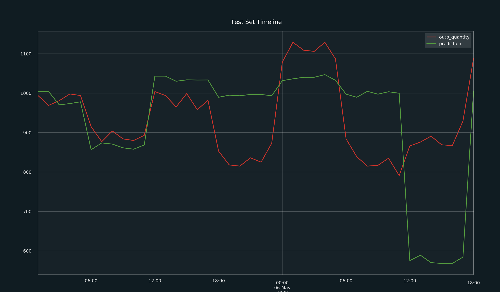

### Parameters

You must provide the following parameters in your `parameters.yml` file:

```yaml
timeline_plot:
    figsize: [16, 9]                             # The size of the figure
    title: "My Plot Title"                       # The title of the figure
    timestamp_col: "timestamp"                   # The column containing timestamp
    columns: ["outp_quantity", "prediction"]     # The columns to plt timelines for - one series per column
    n: 10000                                     # The number of samples to plot
```

### Pipeline

The following pipeline example will create the plot.

```python
from core_pipelines.pipelines import pyplot_charts

pipeline(
    pipe=pyplot_charts.create_pipeline().only_nodes("timeline"),           # name of plot to create
    inputs={"timeline_data": "my_data"},                                   # map input data
    outputs={"timeline_plot": "my_plot"},                                  # map output plot
    parameters={"params:timeline_plot": "params:timeline_plot"}            # provide params
)
```


## SKLearn plot

Creates a plot for an SKLearn model or pipeline which describes the pipeline structure. This is useful for compatibility with other modular pipelines, for example, pyplot_reports.

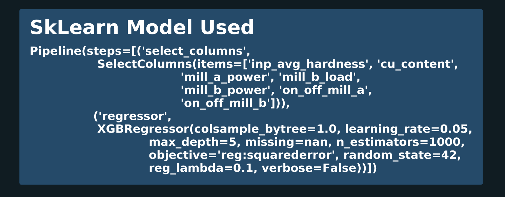


### Parameters

You must provide the following parameters in your `parameters.yml` file:

```yaml
sklearn_plot:
    figsize: [16, 9]                             # The size of the figure
    title: "My Plot Title"                       # The title of the figure
```

### Pipeline

The following pipeline example will create the plot.

```python
from core_pipelines.pipelines import pyplot_charts

pipeline(
    pipe=pyplot_charts.create_pipeline().only_nodes("sklearn"),           # name of plot to create
    inputs={"sklearn_model": "my_model"},                                 # map input model
    outputs={"sklearn_plot": "my_plot"},                                  # map output plot
    parameters={"params:sklearn_plot": "params:sklearn_plot"}             # provide params
)
```


## Pandas `DataFrame` plot

Plots the head of a pandas dataframe as a matplotlib image. This is useful for compatibility with other modular pipelines, for example, pyplot_reports.

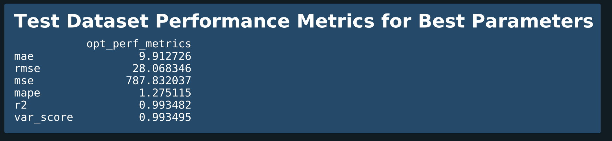

### Parameters

You must provide the following parameters in your `parameters.yml` file:

```yaml
pandas_df_plot:
    figsize: [16, 9]                             # The size of the figure
    title: "My Plot Title"                       # The title of the figure
```

### Pipeline

The following pipeline example will create the plot.

```python
from core_pipelines.pipelines import pyplot_charts

pipeline(
    pipe=pyplot_charts.create_pipeline().only_nodes("pandas_df"),            # name of plot to create
    inputs={"pandas_df_data": "my_data"},                                    # map input data
    outputs={"pandas_df_plot": "my_plot"},                                   # map output plot
    parameters={"params:pandas_df_plot": "params:pandas_df_plot"}            # provide params
)
```
